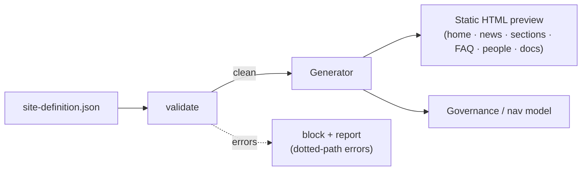

# SharePoint intranet generator

[](https://github.com/derekgallardo01/sharepoint-intranet-generator/actions/workflows/ci.yml)

Generate a complete modern intranet — home, news, section pages, **FAQ page**,
**person directory**, and a document center — from a single
`site-definition.json`, with **schema validation** that catches malformed
blueprints before anything is provisioned in a real tenant. Static HTML
preview you can review before commit.

```bash
python run.py                              # generate the sample intranet → out/
python cli.py validate site-definition.json   # check the blueprint
python cli.py generate site-definition.json --out out/
python evals/run.py                        # 14 validation eval cases, CI-gating
python -m pytest -q                        # 19 unit tests
```

Stdlib-only Python. Self-contained output (inline CSS, no external assets).

## The problem it solves

SharePoint intranet projects stall in design-by-committee: stakeholders can't
picture the structure, so navigation, page layout, and governance get argued
in the abstract. Driving the whole site from one definition file means you
can preview and iterate on the structure in minutes, agree it, then provision
the real thing from the same source of truth. The validator catches the
"section referenced in nav but not defined", "duplicate section key", "people
section with no people" class of blueprint bugs *before* you hit a real
provisioning script.



## Architecture in one paragraph

`validate(definition)` walks the raw blueprint dict and returns a list of
`ValidationError` (each with a dotted JSON path, a human message, and a
severity). `load_intranet` parses the same dict into the typed `Intranet`
model. `render_all` dispatches per `Site.type` to `render_section`,
`render_faq` (an accordion of `<details>`/`<summary>` for `{q, a}` pairs), or
`render_people` (a card grid with photo placeholder + mailto link); plus the
home, news, and document-center renderers. CLI runs `validate` before
`generate` by default; `--skip-validation` bypasses. Full diagrams +
per-component notes: [docs/architecture.md](docs/architecture.md).

## Sample output

```text
=== validate against the sample site-definition.json ===
OK: site-definition.json is structurally valid.

=== validate against a deliberately broken definition ===
[error] org: missing required key 'org'
[warning] tenant: missing 'tenant' (used in the footer)
[error] sites[1].key: duplicate section key 'hr'
[error] sites[2].key: section is missing 'key'
[error] news[0].title: news item is missing 'title'
[error] documentCenter.libraries[0].ownedBy: library 'ownedBy' references unknown section 'ghost'
[error] navigation.global[0].page: section 'Policies' is referenced in nav but not defined (page='policies')

=== generate (8 pages including the new FAQ and people directory) ===
index.html · hr.html · it.html · policies.html · faq.html · people.html · news.html · document-center.html
```

Captured run including the FAQ accordion HTML and a person card snippet:
[docs/sample-run.txt](docs/sample-run.txt).

## Evaluation

Fourteen cases in [evals/golden.json](evals/golden.json) cover the positive
path plus each negative class: missing required keys, duplicate section keys,
missing section title/key, nav pointing at undefined section, doc-center
library owned-by unknown section, news missing title, FAQ without questions,
FAQ entry missing answer, people without people, person without name.

```bash
$ python evals/run.py
Eval: 14/14 passed (100%)
```

How to add cases (real-world malformed definitions, positive-alongside-negative)
is in [docs/evaluation.md](docs/evaluation.md).

## Customization

Six typical tuning points — adding a section, adding a new page type, theme /
branding, tightening validation, provisioning the real tenant, and the
governance model — are walked through in
[docs/customization.md](docs/customization.md). The FAQ and Person Directory
page types are good worked examples for how to add a third.

## What's inside

| Path | Purpose |
|------|---------|
| [site-definition.json](site-definition.json) | The single source of truth: site, nav, sections, FAQ, people, news, documents, governance notes. |
| [examples/site-definition-acme-manufacturing.json](examples/site-definition-acme-manufacturing.json) | A second worked definition — a manufacturing-company intranet (Production / Quality / Supply Chain / Engineering + FAQ + Plant directory). Proves the generator on a different industry. |
| [intranet_gen/model.py](intranet_gen/model.py) | Typed dataclasses for each blueprint slice. |
| [intranet_gen/validate.py](intranet_gen/validate.py) | Structural + reference validation with dotted-path errors. |
| [intranet_gen/render.py](intranet_gen/render.py) | Renderers per `Site.type`: section, FAQ, people, document-center, home, news. |
| [intranet_gen/generate.py](intranet_gen/generate.py) | Glue: load → render → write to disk. |
| [run.py](run.py) | Default demo: writes `out/index.html` + 7 other pages. |
| [cli.py](cli.py) | `validate` and `generate` subcommands; validates before generating by default. |
| [tests/](tests/) | 19 pytest tests covering parsing, render output, validation rules, FAQ/people rendering, CLI exit codes, HTML escaping. |
| [evals/](evals/) | 14 validation cases + CI-gating runner. |
| [governance.md](governance.md) | Information-architecture + governance guidance. |
| [deploy-guide.md](deploy-guide.md) | How to provision the real SharePoint site from the definition. |
| [docs/](docs/) | Architecture, customization, and evaluation guides. |

## Taking it to a real tenant

Agree the structure from the HTML preview, then provision the modern
SharePoint site (communication site, hub nav, document libraries) per
[deploy-guide.md](deploy-guide.md), using the definition file as the spec.
Keep the same `site-definition.json` under source control alongside the
provisioning scripts — and run `python cli.py validate site-definition.json`
before every push so the blueprint hygiene check is part of CI, not a manual
step.
