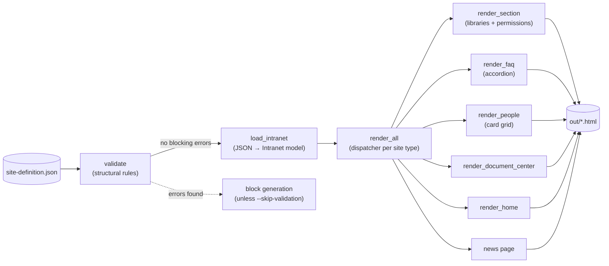
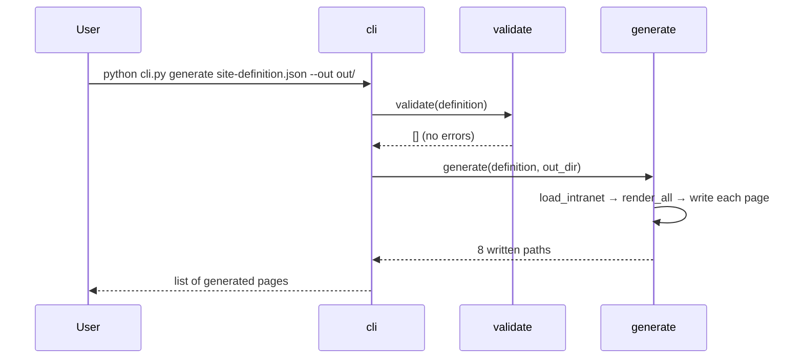
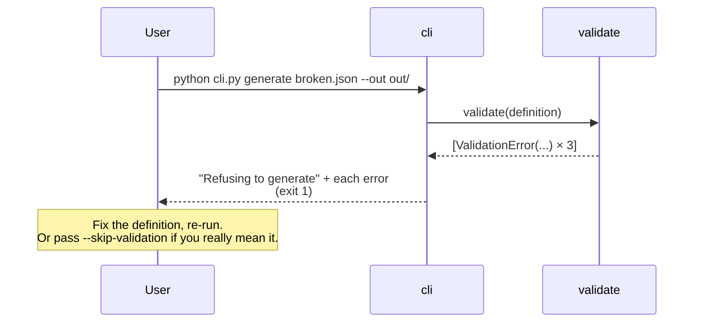

# Architecture

A small stdlib pipeline that goes from one JSON definition to a complete
static HTML preview of the intranet. The preview is the artifact stakeholders
agree on *before* anything is provisioned in the real tenant.

## Components

| Piece | Lives in | Job |
|-------|----------|-----|
| `validate` | [intranet_gen/validate.py](../intranet_gen/validate.py) | Walks the raw blueprint dict and returns a list of `ValidationError` (path + message + severity). |
| `Intranet` model | [intranet_gen/model.py](../intranet_gen/model.py) | Typed dataclasses: `Intranet`, `Site`, `FaqEntry`, `Person`, `DocumentCenter`, `NavLink`, `NewsItem`. |
| `render_all` | [intranet_gen/render.py](../intranet_gen/render.py) | Dispatcher: picks `render_section` / `render_faq` / `render_people` per `Site.type`. |
| `render_section` | [intranet_gen/render.py](../intranet_gen/render.py) | Libraries, columns, links, permissions table. |
| `render_faq` | [intranet_gen/render.py](../intranet_gen/render.py) | `
`/`
` accordion for `{q, a}` pairs. |
| `render_people` | [intranet_gen/render.py](../intranet_gen/render.py) | Card grid: photo placeholder, name, title, mailto link. |
| `generate` | [intranet_gen/generate.py](../intranet_gen/generate.py) | Glues parse + render + write to disk. |
| CLI | [cli.py](../cli.py) | `validate` and `generate` subcommands; `generate` validates first by default. |
| Eval harness | [evals/](../evals/) | 14 validation cases (positive + each negative class). |

## Turn sequence — clean validate + generate

## Turn sequence — validation blocks generation

## Why the design looks like this

- **Validation runs before render, not during.** A render-time crash gives you a
  Python traceback; a validation error gives you a dotted-path message (e.g.
  `sites[1].nav_label`) that a non-engineer client owner can find and fix.
- **`Site.type` dispatches the renderer.** Adding the FAQ and Person Directory
  page types was a small change: one new branch in `render_site`, one new
  renderer function. The blueprint format grew, the rest of the pipeline didn't.
- **Severity is split.** `error` blocks generation; `warning` (e.g. missing
  tenant — used only in the footer) doesn't. Letting all warnings through
  unblocks demos; making them block forces unnecessary blueprint hygiene.
- **Static HTML, inline CSS.** No external CSS, fonts, or scripts. `out/` opens
  anywhere offline — a reviewer doesn't need network access or a build step to
  click through the proposed intranet.

## Where to look first if something goes wrong

| Symptom | Look here |
|---------|-----------|
| Validation false-positive (says invalid but looks right) | Check the relevant `_check_*` function in [validate.py](../intranet_gen/validate.py); add a case to [evals/golden.json](../evals/golden.json) before relaxing the rule. |
| FAQ page doesn't render | Check `site.type == "faq"` in the JSON; the dispatcher in `render_site` only triggers on the exact string. |
| Person photos show as gray circle | `photo_url` empty → renders a `.photo-placeholder`. Provide a URL in the definition. |
| Nav link 404s | Validation catches this — `navigation.global[N].page` must resolve to a section key, "index", "news", "document-center", or the document-center's `key`. |
| New page type doesn't appear | After adding it to the model, add a renderer + dispatch in `render_site`, then add `pages[f"{site.key}.html"]` is already wired via `render_all`. |
