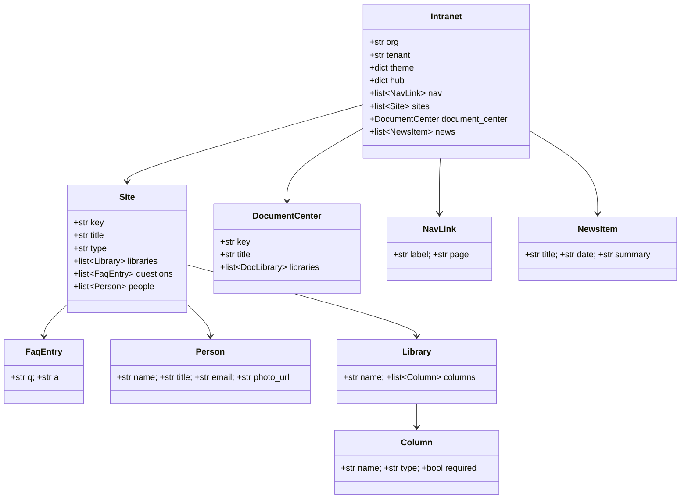
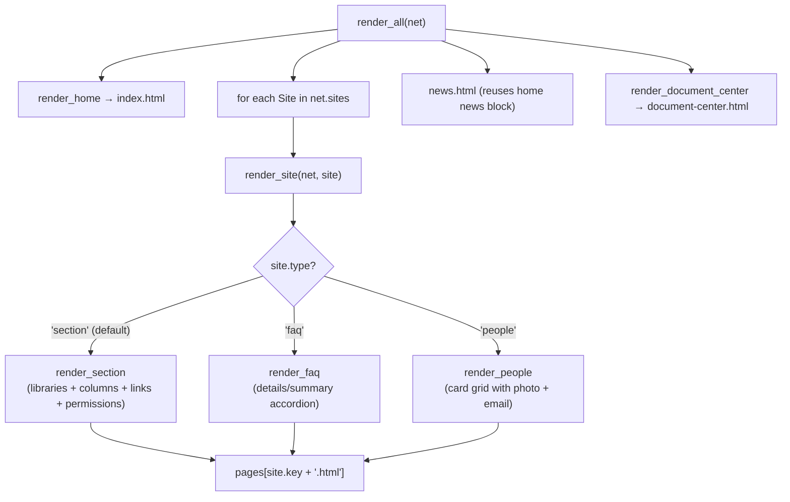
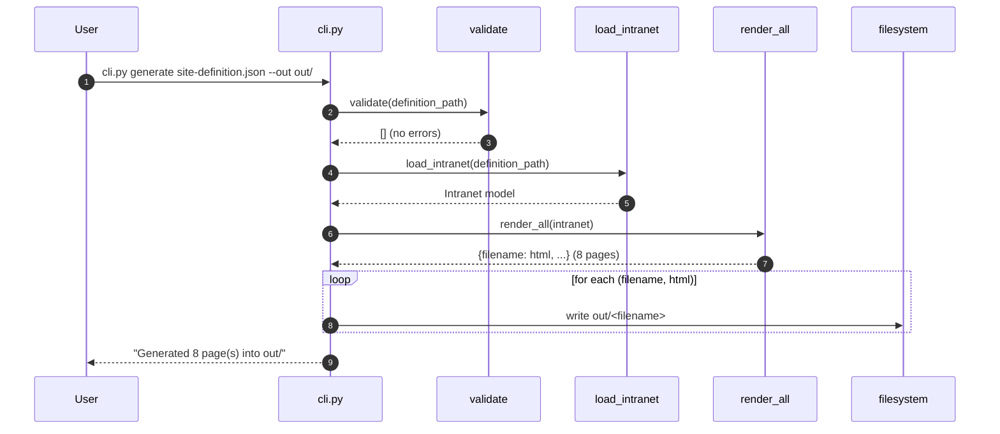
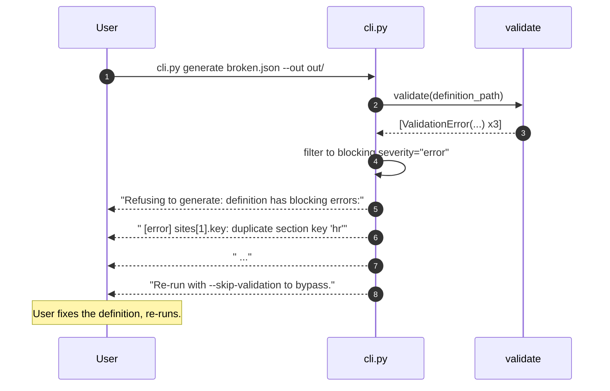
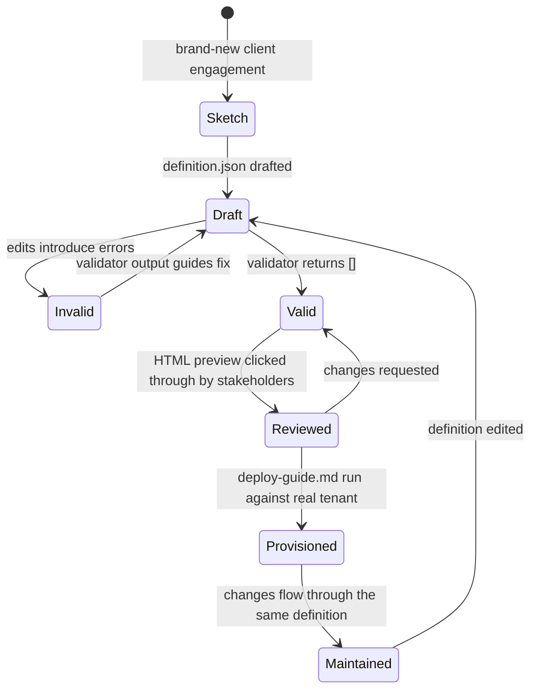

# Diagrams

Beyond the inline ones in [architecture.md](architecture.md).

## 1. Class-ish model — definition.json → typed Intranet

## 2. Render dispatcher — which renderer fires per site type

## 3. Sequence — validate → generate happy path

## 4. Sequence — validation blocks generation

## 5. State — definition lifecycle from sketch to provisioned tenant

